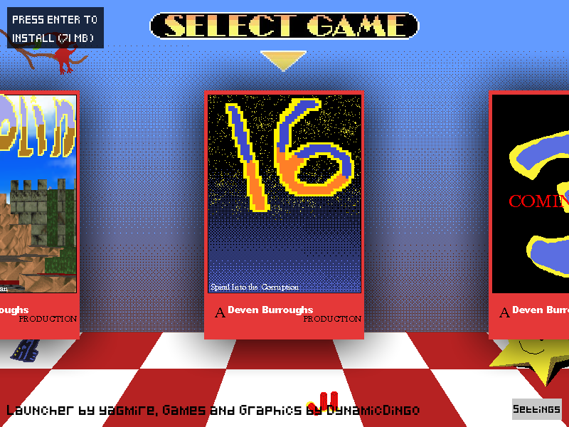
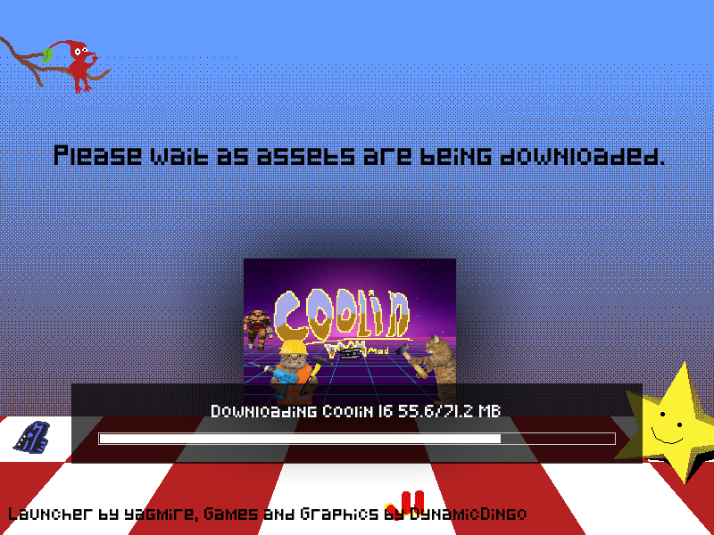
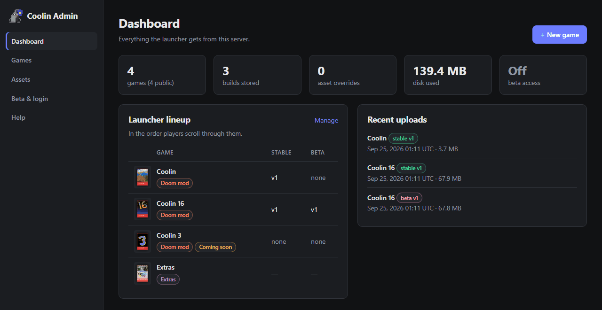
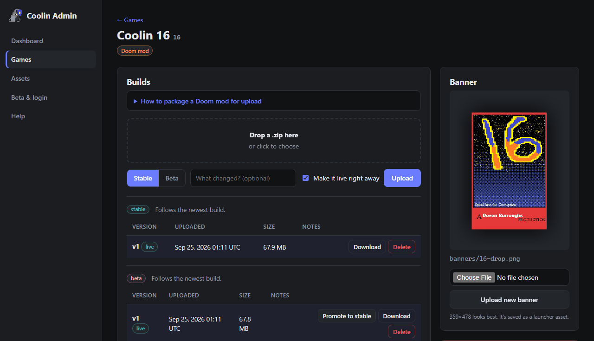
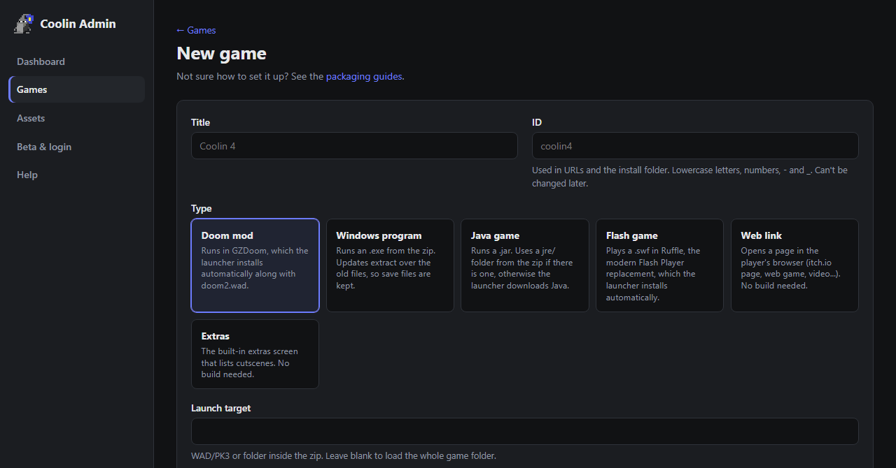
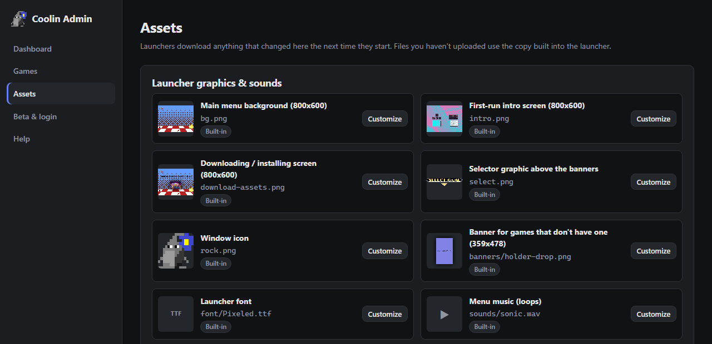

# Coolin Launcher

A specific purpose pygame game launcher for a friend. 

Built by: 

## Screenshots

| Launcher | Installing a game |
| --- | --- |
|  |  |

### Admin panel



| Managing a game's builds | Adding a game |
| --- | --- |
|  |  |



## Game types

Games are managed from the server's admin panel (`/admin`) and show up in the launcher automatically.

| Type | What the launcher does |
| --- | --- |
| Doom mod | Runs the WAD/PK3 (or the whole game folder) in GZDoom, installing GZDoom and doom2.wad on first use |
| Windows program | Runs an `.exe` from the build zip. Updates extract over the old files so saves are kept |
| Flash game | Plays a `.swf` in [Ruffle](https://ruffle.rs), installing it on first use |
| Java game | Runs a `.jar` with the `jre/` folder from the zip, or downloads the chosen Java version (Adoptium) |
| Web link | Opens a URL in the browser |
| Extras | The built-in cutscene list |

Each game can be public, beta-only or hidden, and can be marked "coming soon" with a message.

## Server

```bash
pip install -r requirements.txt
python server.py
```

Deploy `server.py` together with `templates/` and `static/`. Keeping `assets/` next to it lets the admin panel preview the launcher's built-in graphics.

Settings live in a `.env` file next to `server.py` (copy [.env.example](.env.example)). Real environment variables override it.

| Setting | Default | Purpose |
| --- | --- | --- |
| `COOLIN_DATA_DIR` | `/dingo` | Where builds, assets and settings are stored (relative paths are relative to `server.py`) |
| `COOLIN_ADMIN_USER` | `admin` | Admin panel username |
| `COOLIN_ADMIN_PASSWORD` | | Admin panel password. The panel is disabled until this is set |
| `COOLIN_HOST` / `COOLIN_PORT` | `0.0.0.0` / `2665` | Address to listen on |
| `COOLIN_TRUST_PROXY` | `0` | Set to `1` behind a reverse proxy so rate limits see real client IPs |

### Docker

```bash
docker build -t coolin-server .
docker run -d --name coolin -p 2665:2665 --env-file .env -v /dingo:/dingo --restart unless-stopped coolin-server
```

- The image runs the server with gunicorn on Python 3.13. It starts as root only long enough to give `/dingo` to its app user (uid `10001`), then runs the server as that user.
- Put your `.env` settings in with `--env-file` or `-e`. `COOLIN_DATA_DIR` is already `/dingo` inside the container, so leave it out of the file.
- Everything the server stores is in `/dingo`. Mount a folder or named volume there to keep it between upgrades. Root-owned host folders are fine: their ownership is fixed on startup.
- Behind nginx, Caddy or Cloudflare, set `COOLIN_TRUST_PROXY=1`.
- `GET /healthz` is used by the container health check and isn't rate limited.

The admin panel has four pages:

- **Dashboard**: overview and problems that need fixing
- **Games**: add games, set their order, upload builds per branch, make an older build live (rollback), promote beta builds to stable
- **Assets**: replace launcher graphics, sounds and banners. Launchers download changes when they start
- **Beta & login**: beta key

On first start the server creates `catalog.json` from the existing game folders, so older launchers keep working through the legacy `/get_latest_ver` and `/download` endpoints.

The launcher talks to `https://coolin.yagmire.org/` by default. To use another server, set `COOLIN_SERVER` in a `.env` next to the launcher, or bundle a `.env` into the PyInstaller build.

## Badges

[](https://choosealicense.com/licenses/mit/)


## Authors

- [@yagmire (GitHub)](https://www.github.com/yagmire) (Launcher code)
- [@dynamicdingo987 (Instagram)](https://instagram.com/dynamicdingo987) (Assets & Games)

## License

[MIT](https://choosealicense.com/licenses/mit/)

